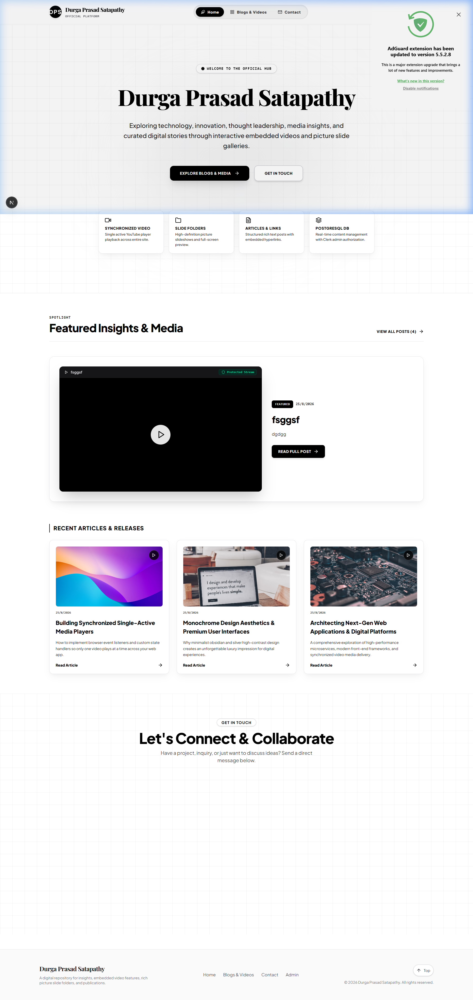

# Blog Post including Youtube Video Protected

A modern, full-stack blog platform built with **Next.js 16**, featuring embedded YouTube videos, image carousels, Clerk authentication, and a PostgreSQL database powered by Prisma ORM.


---

## Features

- **Blog Management** — Create, edit, and publish blog posts with rich text content
- **YouTube Integration** — Embed YouTube videos directly in blog posts with synchronized single-player playback
- **Image Carousels** — High-definition picture slideshows with full-screen preview capability
- **Admin Authentication** — Protected admin panel using Clerk authentication
- **Dark / Light Mode** — Beautiful theme switching with glassmorphism design
- **Responsive Design** — Fully responsive layout optimized for all devices
- **Contact Form** — Built-in contact form for visitor messages
- **PostgreSQL Database** — Powered by Neon PostgreSQL with Prisma ORM

---

## Tech Stack

| Technology | Purpose |
|---|---|
| [Next.js 16](https://nextjs.org/) | React framework with App Router |
| [React 19](https://react.dev/) | UI library |
| [TypeScript](https://www.typescriptlang.org/) | Type safety |
| [Tailwind CSS 4](https://tailwindcss.com/) | Utility-first CSS |
| [Prisma](https://www.prisma.io/) | Database ORM |
| [Clerk](https://clerk.com/) | Authentication |
| [Framer Motion](https://www.framer.com/motion/) | Animations |
| [Lucide React](https://lucide.dev/) | Icons |
| [React Icons](https://react-icons.github.io/react-icons/) | Icon library |

---

## Project Structure

```
├── app/
│   ├── actions/         # Server actions for blog & contact
│   ├── admin/           # Protected admin panel
│   ├── api/             # API routes
│   ├── blogs/           # Blog listing & detail pages
│   ├── sign-in/         # Clerk sign-in page
│   ├── sign-up/         # Clerk sign-up page
│   ├── globals.css      # Global styles
│   ├── layout.tsx       # Root layout with providers
│   └── page.tsx         # Homepage
├── components/
│   ├── ContactForm.tsx      # Contact form component
│   ├── Footer.tsx           # Site footer
│   ├── ImageCarousel.tsx    # Image slideshow component
│   ├── Navbar.tsx           # Navigation bar
│   ├── ThemeProvider.tsx    # Dark/Light mode provider
│   └── YouTubeEmbed.tsx    # YouTube video player
├── lib/                 # Utility functions & Prisma client
├── prisma/
│   ├── schema.prisma    # Database schema
│   └── seed.ts          # Database seed data
├── middleware.ts        # Clerk auth middleware
└── public/              # Static assets
```

---

## Getting Started

### Prerequisites

- Node.js 18+ installed
- A [Clerk](https://clerk.com/) account for authentication
- A PostgreSQL database (e.g., [Neon](https://neon.tech/))

### Installation

1. **Clone the repository**
   ```bash
   git clone https://github.com/Rishikeshk6/Blog-Post-including-Youtube-Video-Protected.git
   cd Blog-Post-including-Youtube-Video-Protected
   ```

2. **Install dependencies**
   ```bash
   npm install
   ```

3. **Set up environment variables**

   Create a `.env.local` file in the root directory:
   ```env
   NEXT_PUBLIC_CLERK_PUBLISHABLE_KEY=your_clerk_publishable_key
   CLERK_SECRET_KEY=your_clerk_secret_key
   DATABASE_URL=your_postgresql_database_url
   NEXT_PUBLIC_CLERK_SIGN_IN_URL=/sign-in
   NEXT_PUBLIC_CLERK_SIGN_UP_URL=/sign-up
   NEXT_PUBLIC_CLERK_AFTER_SIGN_IN_URL=/admin
   NEXT_PUBLIC_CLERK_AFTER_SIGN_UP_URL=/admin
   ```

4. **Set up the database**
   ```bash
   npx prisma generate
   npx prisma db push
   ```

5. **Seed the database (optional)**
   ```bash
   npx prisma db seed
   ```

6. **Run the development server**
   ```bash
   npm run dev
   ```

7. Open [http://localhost:3000](http://localhost:3000) in your browser.

---

## Screenshots

### Homepage



---

## Database Schema

The application uses three main models:

- **BlogPost** — Stores blog articles with title, content, YouTube URLs, and image arrays
- **ContactMessage** — Stores visitor contact form submissions
- **AdminUser** — Manages admin user access

---

## Authentication

The admin panel (`/admin`) is protected using Clerk authentication middleware. Only authenticated users can access the admin dashboard to manage blog posts and view contact messages.

---

## License

This project is open source and available under the [MIT License](LICENSE).

## Author

**Rishikeshk6** — [GitHub Profile](https://github.com/Rishikeshk6)

---

If you found this project helpful, please consider giving it a star.
